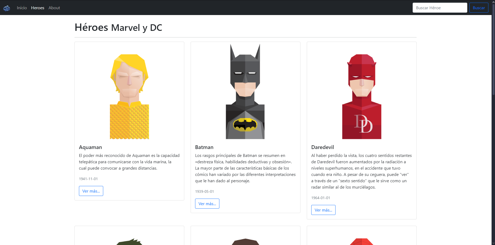

<!-- PROJECT SHIELDS -->

[![Forks][forks-shield]][forks-url]
[![Stargazers][stars-shield]][stars-url]
[![Issues][issues-shield]][issues-url]

<!-- PROJECT LOGO -->
<br>
<div align="center">
    
    <h3 align="center">SUPERHEROES APP</h3>
    <p align="center">
        Una aplicación interactiva, desarrollada en Angular, que permite explorar y conocer información detallada sobre una amplia gama de héroes de cómics. Diseñada para fans del universo de los superhéroes, ofrece una experiencia visualmente atractiva y sencilla de usar.
        <br />
    </p>
</div>

---

## Tabla de Contenidos

1. [Descripción General](#descripcion-general)
2. [Características](#caracteristicas)
3. [Requisitos y Aplicación](#requisitos-y-aplicacion)
4. [Contacto](#contacto)

---

## Descripción General

Superheroes Explorer es una aplicación web que permite explorar y consultar información sobre héroes de cómics de distintos universos (Marvel, DC, entre otros). Podrás descubrir detalles como su historia de origen, habilidades especiales, afiliaciones y estadísticas, todo presentado en un diseño intuitivo y responsivo.<br>


<p align="right">(<a href="#">volver arriba</a>)</p>

---

## Características

- **Exploración de héroes**: Busca héroes por nombre, universo o habilidades específicas.
- **Información detallada**: Accede a estadísticas completas, habilidades, biografías y más.
- **Diseño responsivo**: Compatible con dispositivos móviles y escritorio.
- **Visualización dinámica**: Animaciones y diseño interactivo para mejorar la experiencia del usuario.

<p align="right">(<a href="#">volver arriba</a>)</p>

---

## Requisitos y Aplicación

- Node.js v14.0 o superior.
- Angular CLI v16.1.5 o superior.
- Navegador web moderno (Google Chrome, Firefox, Edge, etc.).

#### Instalación de Dependencias
Asegúrate de instalar todas las dependencias necesarias con:
```bash
npm install
```

#### Servidor de desarrollo

Ejecuta `ng serve -o` para iniciar un servidor de desarrollo. Navega a `http://localhost:4200/`. La aplicación se recargará automáticamente si realizas cambios en cualquiera de los archivos fuente.

#### Creación de componentes

Ejecuta `ng generate component nombre-del-componente` para generar un nuevo componente. También puedes usar `ng generate directive|pipe|service|class|guard|interface|enum|module` para crear otros elementos.

#### Construcción del proyecto

Ejecuta `ng build` para construir el proyecto. Los artefactos de la construcción se almacenarán en el directorio `dist/`.

#### Ejecución de pruebas unitarias

Ejecuta `ng test` para ejecutar las pruebas unitarias utilizando [Karma](https://karma-runner.github.io).

#### Ejecución de pruebas de extremo a extremo

Ejecuta `ng e2e` para ejecutar pruebas de extremo a extremo (end-to-end) mediante una plataforma de tu elección. Para usar este comando, primero necesitas añadir un paquete que implemente las capacidades de pruebas de extremo a extremo.

#### Más ayuda

Para obtener más ayuda sobre Angular CLI, usa el comando `ng help` o consulta la página [Angular CLI Overview and Command Reference](https://angular.io/cli).

<p align="right">(<a href="#">volver arriba</a>)</p>

--- 
## Contacto 

Puedes ponerte en contacto conmigo a través de:

- **Correo electrónico**: [jesuusgp14.2002@gmail.com](mailto:jesuusgp14.2002@gmail.com)
- **LinkedIn**: [JESUSGPMP14](https://www.linkedin.com/in/jesusgpmp14/)

<p align="right">(<a href="#">volver arriba</a>)</p>

[forks-shield]: https://img.shields.io/github/forks/JESUSGPMP14/HEROES-APP.svg?style=for-the-badge
[forks-url]: https://github.com/JESUSGPMP14/HEROES-APP/network/members
[stars-shield]: https://img.shields.io/github/stars/JESUSGPMP14/HEROES-APP.svg?style=for-the-badge
[stars-url]: https://github.com/JESUSGPMP14/HEROES-APP/stargazers
[issues-shield]: https://img.shields.io/github/issues/JESUSGPMP14/HEROES-APP.svg?style=for-the-badge
[issues-url]: https://github.com/JESUSGPMP14/HEROES-APP/issues